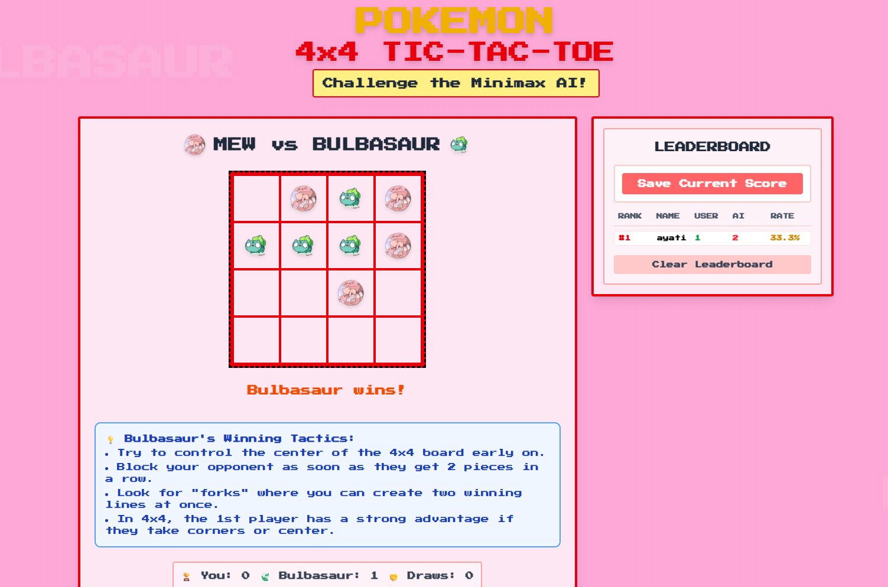
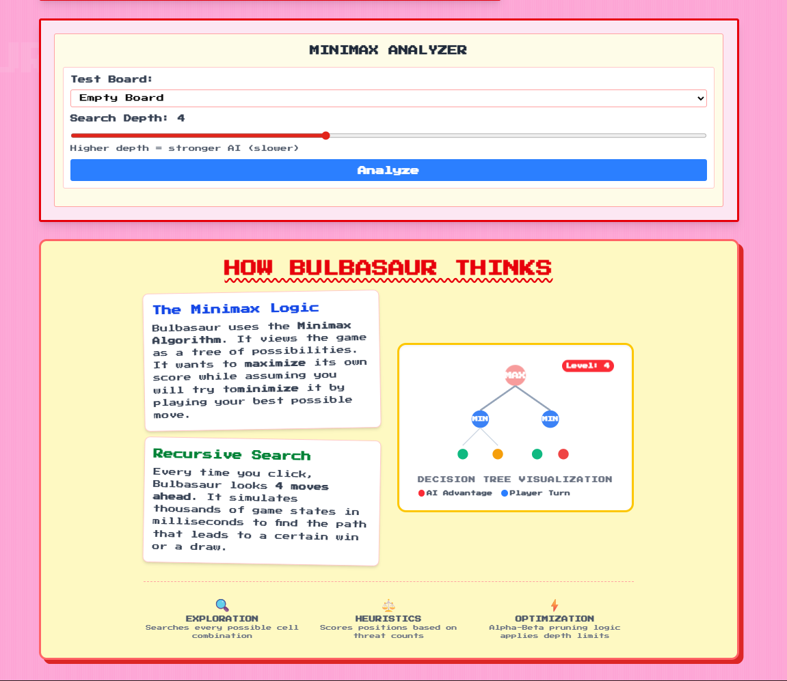

# Pokemon 4x4 Tic-Tac-Toe

An interactive Pokemon-themed 4x4 Tic-Tac-Toe experience powered by Next.js, TypeScript, and a Minimax AI engine.

[](https://nextjs.org/)
[](https://react.dev/)
[](https://www.typescriptlang.org/)
[](https://tailwindcss.com/)

## Overview

This project blends classic Tic-Tac-Toe strategy with a Pokemon-inspired interface and AI gameplay.

- 🎮 Play on a 4x4 game board with responsive interactions
- 🤖 Challenge Bulbasaur AI powered by Minimax decision-making
- 📊 Track wins, losses, and in-game leaderboard performance
- 🧠 Explore algorithm behavior through a visual dashboard

## Screenshots

### 🖥️ Main Interface



### 📈 Gameplay / Dashboard View



## ✨ Core Features

- ✅ 4x4 Tic-Tac-Toe gameplay loop
- ✅ Minimax-powered AI move selection
- ✅ Leaderboard and match statistics
- ✅ Strategy visualization and educational algorithm panel

## 🧰 Tech Stack

- Next.js 16
- React 19
- TypeScript
- Tailwind CSS 4
- Radix UI

## 🚀 Getting Started

### Prerequisites

- Node.js 18+
- pnpm

### Installation

```bash
pnpm install
```

### Run in Development

```bash
pnpm dev
```

Open [http://localhost:3000](http://localhost:3000) in your browser.

## 📜 Available Scripts

- `pnpm dev` - Start local development server
- `pnpm build` - Create production build
- `pnpm start` - Run production server
- `pnpm lint` - Run lint checks

## 📁 Project Structure

- `app/` - App Router pages, layout, and global styles
- `components/` - Game UI and reusable components
- `hooks/` - Custom React hooks
- `lib/` - Core game logic and Minimax implementation
- `public/` - Static assets and images
- `styles/` - Additional global and shared styles

## 🤝 Collaborators

| Name | Profiles |
| :--- | :--- |
| **Aaditya Jaiswar** | [](https://github.com/yourusername) []( www.linkedin.com/in/aadityaaaaa ) |
| **Raj Gupta** | [](www.github.com/aad1tyaaaaa) [](https://linkedin.com/in/rajprofile) |

> Replace placeholder profile links with your real GitHub and LinkedIn URLs.

## 📄 License

This project is intended for educational and personal use.
# pokemon-tic-tac-toe
